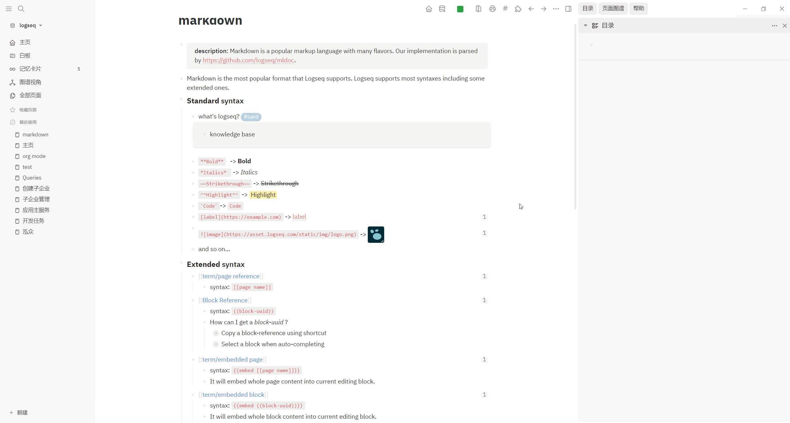

# logseq-plugin-pdf-print

打印当前页面为pdf, 由于直接使用window.print()实现,基本保留了当前所见的所有样式(除了代码块/(ㄒoㄒ)/~~)

> 目前 [sawhney17/logseq-pdf-export](https://github.com/sawhney17/logseq-pdf-export) 也合并了本插件的相关代码功能, 见[将功能合并到现有 PDF 导出插件中的提案](https://github.com/supery-chen/logseq-plugin-pdf-print/issues/1#issue-1228911405)

## 示例

## Tips

1. 如点击后没有反应，建议检查下系统的打印机服务`Print Spooler`是否启用，启用服务后重试
